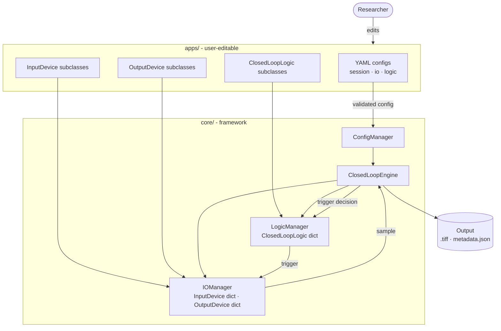

# CLEF2 System Overview

All boxes are **runtime instances**. Arrows show **data flow** (labeled) or **control flow** (unlabeled). Inheritance is not shown here — see `class_hierarchy.md`.

**Legend**

| Symbol | Meaning |
|---|---|
| `([...])` rounded | External actor |
| `[...]` rectangle | Runtime instance |
| Subgraph | Directory / module grouping |
| `-->` unlabeled | Control flow (initialize, orchestrate) |
| `-->` labeled | Data flow — label names what is passed |
| `[(...)]` cylinder | Persistent storage |
