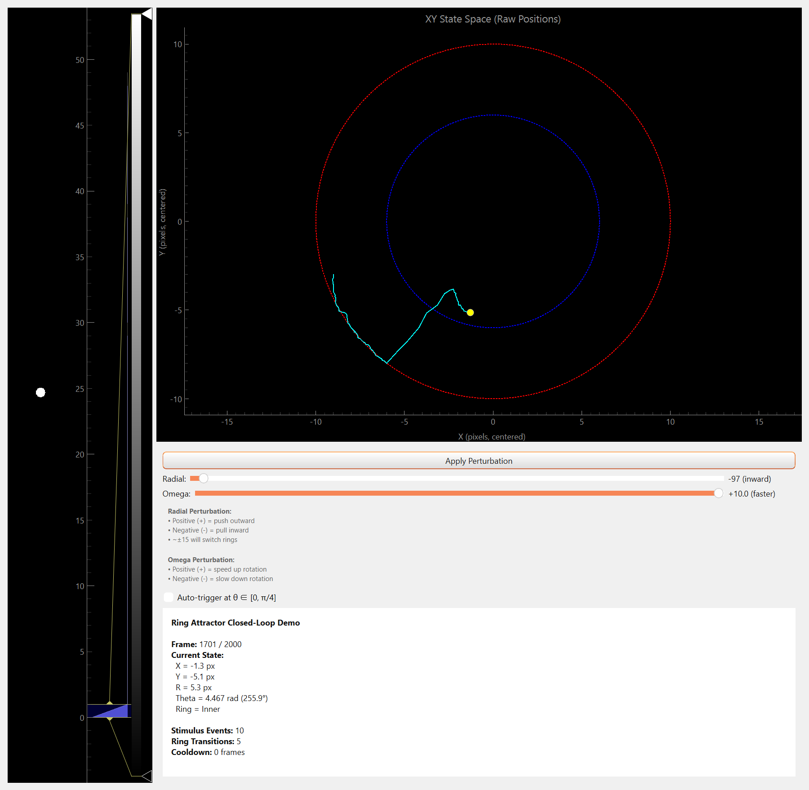
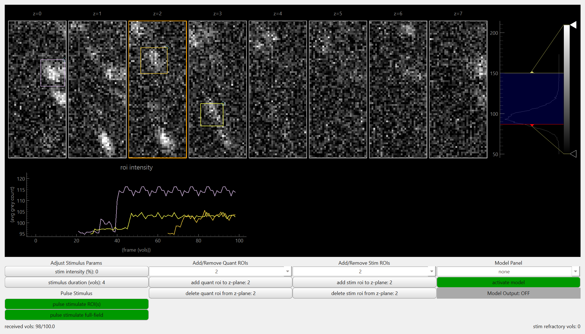

# CLEF: Closed-Loop Experimental Framework

## Introduction

CLEF (Closed-Loop Experimental Framework) is an open-source Python platform for real-time closed-loop microscopy experiments with automated stimulus control. It targets volumetric calcium imaging in neuroscience, enabling researchers to observe neural activity and deliver stimuli in a single feedback loop governed entirely by declarative configuration files.

CLEF replaces ad-hoc lab scripts and GUI-only workflows with a modular, config-driven architecture where hardware backends, analysis algorithms, and stimulus controllers are interchangeable components selected at runtime via YAML.

## Motivation

Closed-loop paradigms, where neural activity is decoded online and used to trigger stimuli in real time, are increasingly central to systems neuroscience (Grosenick et al., 2015; Packer et al., 2015). These approaches allow researchers to deliver perturbations contingent on ongoing brain dynamics, enabling causal interrogation of neural circuits that is not possible with open-loop stimulus protocols.

However, most existing tools either require non-Python languages (Bonsai, C#; ScanImage, MATLAB; Open Ephys, C++), target electrophysiology rather than imaging (RTXI, Open Ephys), or provide analysis libraries without experiment orchestration (CaImAn, Suite2p). Researchers performing volumetric calcium imaging with closed-loop stimulus delivery currently lack a Python-native framework that unifies hardware control, online analysis, and stimulus triggering under a single reproducible configuration.

CLEF fills this gap by providing a complete pipeline from microscope control through real-time analysis to stimulus delivery, configured entirely through validated YAML files and extensible through Python.

**Figure 1.** System overview of CLEF. YAML configuration files are validated by Pydantic models and passed to the ClosedLoopEngine, which orchestrates the real-time acquisition loop. The engine coordinates three subsystems: a HardwareManager that provides data through swappable backends, an Algorithm that processes each sample and detects trigger conditions, and a StimulusController that delivers perturbations to the preparation.

## Architecture

CLEF follows a layered architecture that separates configuration, orchestration, hardware abstraction, and analysis:

- **CLI entry point** (`cli/clef_cli.py`) parses YAML configs validated by Pydantic models.
- **ConfigManager** (`config/config_manager.py`) loads, validates, and merges three configuration types (hardware, experiment, algorithm) with sensible defaults. Pydantic validation catches invalid parameters before any hardware is initialized.
- **ClosedLoopEngine** (`engine/closed_loop_engine.py`) orchestrates the real-time loop: initialize hardware, algorithm, and stimulus controller, then iterate sample-by-sample through the acquisition.
- **HardwareManager** (`hardware/hardware_manager.py`) selects a backend implementing `BaseHardwareBackend` and exposes a generic `DataInterface` for sampling. Available backends include `dummy` (testing), `pycromanager`/`pymmcore` (real microscope hardware via Micro-Manager), `lorenz_demo`, `ring_attractor_demo`, and `screenshot`.
- **Algorithm registry** (`algorithms/algorithm_factory.py`) uses a factory pattern to instantiate pluggable algorithms that implement `process_sample()` and `check_stim()`.
- **Stimulus controllers** (`hardware/stimulus_controllers/`) abstract hardware-specific actuation behind `StimulusInterface`, supporting dummy, polygon (DMD), and demo-specific controllers.

### Micro-Manager Integration via pycro-manager

CLEF interfaces with microscope hardware through pycro-manager (Pinkard et al., 2021) and pymmcore, the Python bindings for Micro-Manager (Edelstein et al., 2014). Micro-Manager provides device adapters for hundreds of microscopy components (cameras, stages, filter wheels, light sources, shutters), and pycro-manager exposes this functionality to Python with support for multi-dimensional acquisition, hardware-triggered sequencing, and direct access to the Micro-Manager Core API. By building on this ecosystem, CLEF inherits broad hardware compatibility without implementing device-specific drivers. The `MicroManagerBackend` wraps these APIs behind CLEF's `BaseHardwareBackend` interface, so that the rest of the framework (engine, algorithms, stimulus controllers) remains agnostic to the underlying hardware communication layer.

**Figure 2.** Class hierarchy of CLEF's core abstractions. Each subsystem defines an abstract base class (BaseHardwareBackend, BaseAlgorithm, BaseStimulusController) with concrete implementations selected at runtime via configuration. The HardwareManager exposes a generic DataInterface, decoupling algorithms from specific data sources. The ClosedLoopEngine composes all three subsystems to run the acquisition loop.

## Key Design Features

| Feature | Description |
|---------|-------------|
| **Config-driven reproducibility** | Entire experiments are specified in version-controllable YAML files. Pydantic validation catches errors before acquisition begins. |
| **Hardware abstraction** | Swappable backends (dummy for testing, pycro-manager/pymmcore for real microscopes, demo generators) behind a uniform `DataInterface`. |
| **Pluggable algorithms** | Registry-based factory pattern. New analysis methods are added by implementing `initialize_model()` and `process_sample()`, then registering a string name. No framework code changes required. |
| **Generic data interface** | Supports uint16 microscopy volumes, RGB screenshots, 1-D timeseries, and other modalities. Algorithms are not locked to a single data type. |
| **Testability** | Dummy and demo backends enable full integration testing without physical hardware, with 377+ automated tests covering the complete pipeline from config loading through stimulus delivery. |

## Demos

CLEF ships with several demo configurations that illustrate the framework's capabilities across a range of use cases, from synthetic dynamical systems to real microscope hardware.

### Ring Attractor Demo

The ring attractor demo underscores the core conceptual motivation for CLEF. Closed-loop experimental frameworks exist to interrogate dynamical biological processes, and brains are perhaps the most compelling example. In this demo, a synthetic dynamical system (a bistable ring attractor with two concentric limit cycles) produces time-varying data, and the experimenter delivers perturbations to understand how the system works. It is, in essence, a game: the system evolves according to its own dynamics, and the experimenter must observe, hypothesize, and intervene in real time.

The ring attractor backend generates 2D image frames depicting a punctum orbiting on one of two concentric rings. The system state is defined by an angular position and a radial mode (inner or outer ring). The experimenter can deliver stimuli that perturb the angular position or toggle the system between rings. An auto-trigger mode is also available, where the algorithm fires stimuli when the system enters a specified angular region. This demo illustrates how CLEF decouples data generation, online analysis, and stimulus control into independently configurable components.

**Figure 3.** Screenshot of the ring attractor demo during a live session. The visualization shows the punctum orbiting on one of two concentric rings, with a fading trajectory trail indicating recent history. The experimenter can deliver angular perturbations or toggle the system between rings using the GUI controls, observing the effect of each intervention in real time.

**Configs:** `config/demo/demo_ring_attractor_hardware.yaml`, `demo_ring_attractor_experiment.yaml`, `demo_ring_attractor_algorithm.yaml`

### Lorenz Attractor Demo

The Lorenz attractor demo uses a classic chaotic dynamical system (Lorenz, 1963) as a synthetic data source. The backend integrates the Lorenz equations in real time and renders the 3D state as a 2D image (a bright punctum on a 100x100 pixel field). The algorithm extracts the system's phase-space coordinates and fires a stimulus when the state enters a configurable trigger volume. The stimulus applies a perturbation vector to the Lorenz state variables, visibly deflecting the trajectory.

This demo is useful for validating the full closed-loop pipeline (data acquisition, algorithm processing, trigger detection, stimulus delivery) without any physical hardware, and for illustrating how CLEF handles chaotic systems where stimulus timing relative to system state is critical.

**Configs:** `config/demo/demo_lorenz_hardware.yaml`, `demo_lorenz_experiment.yaml`, `demo_lorenz_algorithm.yaml`

### Brainalyzer Demo

The Brainalyzer demo provides the same GUI and analysis interface as the physical hardware configuration, but reads data from an existing volumetric calcium imaging dataset (a TIFF stack) rather than acquiring live from a microscope. This allows users to develop, test, and refine their analysis pipelines against real neural data without requiring access to microscope hardware. The algorithm performs real-time quantification of neural activity across z-planes and supports stimulus parameter exploration through the interactive GUI.

**Figure 4.** Screenshot of the Brainalyzer demo GUI. The interface displays volumetric calcium imaging data read from a TIFF stack, with real-time quantification of neural activity across z-planes. This demo provides the same analysis and stimulus control interface as the physical hardware configuration, allowing algorithm development and parameter exploration without a connected microscope.

**Configs:** `config/demo/demo_brainalyzer_hardware.yaml`, `demo_brainalyzer_experiment.yaml`, `demo_brainalyzer_algorithm.yaml`

### Physical Hardware Demo

The physical hardware demo provides an example of CLEF running a full volumetric calcium imaging experiment with real-time quantification and patterned optogenetic illumination using the Mightex Polygon1000 digital micromirror device (DMD). This demo can only be run with the appropriate microscope hardware configured (camera, stage, Micro-Manager device adapters, and Polygon1000). It represents the primary production use case for CLEF: acquiring volumetric calcium imaging data, processing it online, and delivering spatially patterned optogenetic stimuli in closed loop.

### Why These Demos

Each demo was chosen to highlight a different aspect of the framework:

- The **ring attractor** and **Lorenz** demos demonstrate that CLEF's architecture is not specific to microscopy. Any system that produces sequential data samples and accepts perturbations can be wrapped as a backend. These demos also allow new users to explore the full closed-loop workflow on any machine, with no hardware dependencies.
- The **Brainalyzer** demo bridges the gap between synthetic and real data, enabling algorithm development against genuine neural recordings without tying up microscope time.
- The **physical hardware** demo shows the end-to-end production configuration, demonstrating CLEF's integration with Micro-Manager, pycro-manager, and real optical hardware.

## Related Projects

| Tool | Language | Domain | Closed-Loop | Config-Driven | Reference |
|------|----------|--------|-------------|---------------|-----------|
| **Bonsai** | C# | General experiment control | Yes | No (visual XML workflows) | Lopes et al., 2015 |
| **Open Ephys GUI** | C++ | Electrophysiology | Yes | No (GUI) | Siegle et al., 2017 |
| **CaImAn** | Python | Calcium imaging analysis | Partial (OnACID) | No | Giovannucci et al., 2019 |
| **Suite2p** | Python | Calcium imaging analysis | No (offline) | No | Pachitariu et al., 2017 |
| **Micro-Manager** | Java/C++ | Microscope control | No | Partial | Edelstein et al., 2014 |
| **pycro-manager** | Python/Java | Microscope control (Python) | No | No | Pinkard et al., 2021 |
| **ScanImage** | MATLAB | Two-photon microscopy | Partial | No | Pologruto et al., 2003 |
| **Stytra** | Python | Zebrafish behavior + light-sheet | Yes | Partial | Stih et al., 2019 |
| **RTXI** | C++ | Hard real-time electrophysiology | Yes | No | Patel et al., 2017 |
| **ACQ4** | Python | Patch-clamp + imaging | Partial | No | Campagnola et al., 2014 |
| **Autopilot** | Python | Distributed behavioral rigs | Yes | Yes | Saunders & Wehr, 2019 |

### What Makes CLEF Unique

1. **Python-native closed-loop for volumetric calcium imaging.** No other Python framework combines real-time volumetric calcium imaging acquisition with online analysis and stimulus feedback. CaImAn provides algorithms but not orchestration; Stytra targets zebrafish light-sheet specifically; pycro-manager provides microscope control but not closed-loop logic.

2. **Declarative, validated configuration.** YAML files validated by Pydantic models mean experiments are fully specified in version-controllable text files. Invalid configurations are caught before hardware is initialized. This contrasts with Bonsai's visual XML workflows, ScanImage's MATLAB scripts, and the ad-hoc parameter passing common in lab code.

3. **Swappable hardware backends with a generic data interface.** The `DataInterface` abstraction decouples algorithms from data sources. The same algorithm code runs against a dummy backend in CI, a Lorenz attractor demo on a laptop, or a real microscope in the lab. This is made possible by building on Micro-Manager and pycro-manager for hardware communication while abstracting the interface one level higher.

4. **Algorithm registry pattern.** New online analysis methods are added by implementing `initialize_model()` and `process_sample()`, then registering a string name. No framework code changes are required.

5. **Full testability without hardware.** The dummy backend and demo backends (Lorenz, ring attractor) enable 377+ automated tests covering the complete pipeline from config loading through stimulus delivery.

## References

- Campagnola, L., Kratz, M.B. & Bhatt, D.B. "ACQ4: An open-source software platform for data acquisition and analysis in neurophysiology research." *Front. Neuroinform.* 8, 3 (2014). DOI: 10.3389/fninf.2014.00003
- Edelstein, A.D., Tsuchida, M.A., Amodaj, N., Pinkard, H., Vale, R.D. & Stuurman, N. "Advanced methods of microscope control using muManager software." *J. Biol. Methods* 1, e10 (2014). DOI: 10.14440/jbm.2014.36
- Giovannucci, A. et al. "CaImAn: An open source tool for scalable calcium imaging data analysis." *eLife* 8, e38173 (2019). DOI: 10.7554/eLife.38173
- Grosenick, L., Marshel, J.H. & Deisseroth, K. "Closed-loop and activity-guided optogenetic control." *Neuron* 86, 106-139 (2015). DOI: 10.1016/j.neuron.2015.03.034
- Lopes, G. et al. "Bonsai: An event-driven framework for processing and controlling data streams." *Front. Neuroinform.* 9, 7 (2015). DOI: 10.3389/fninf.2015.00007
- Lorenz, E.N. "Deterministic nonperiodic flow." *J. Atmos. Sci.* 20, 130-141 (1963). DOI: 10.1175/1520-0469(1963)020<0130:DNF>2.0.CO;2
- Newman, J.P. et al. "Optogenetic feedback control of neural activity." *eLife* 4, e07192 (2015). DOI: 10.7554/eLife.07192
- Pachitariu, M. et al. "Suite2p: beyond 10,000 neurons with standard two-photon microscopy." *bioRxiv* (2017). DOI: 10.1101/061507
- Packer, A.M., Russell, L.E., Dalgleish, H.W.P. & Hausser, M. "Simultaneous all-optical manipulation and recording of neural circuit activity with cellular resolution in vivo." *Nat. Methods* 12, 140-146 (2015). DOI: 10.1038/nmeth.3217
- Pinkard, H., Stuurman, N., Ivber, I.E., Vaidyanathan, N., Ber, I.E. & Waller, L. "Pycro-Manager: open-source software for customized and reproducible microscope control." *Nat. Methods* 18, 226-228 (2021). DOI: 10.1038/s41592-021-01087-6
- Pologruto, T.A., Sabatini, B.L. & Bhatt, D.B. "ScanImage: Flexible software for operating laser scanning microscopes." *BioMed. Eng. Online* 2, 13 (2003). DOI: 10.1186/1475-925X-2-13
- Stih, V., Petrucco, L., Kist, A.M. & Portugues, R. "Stytra: An open-source, integrated system for stimulation, tracking and closed-loop behavioral experiments." *PLOS Comput. Biol.* 15, e1006699 (2019). DOI: 10.1371/journal.pcbi.1006699
- Saunders, J. & Wehr, M. "Autopilot: Automating behavioral experiments with lots of Raspberry Pis." *bioRxiv* (2019). DOI: 10.1101/807693
