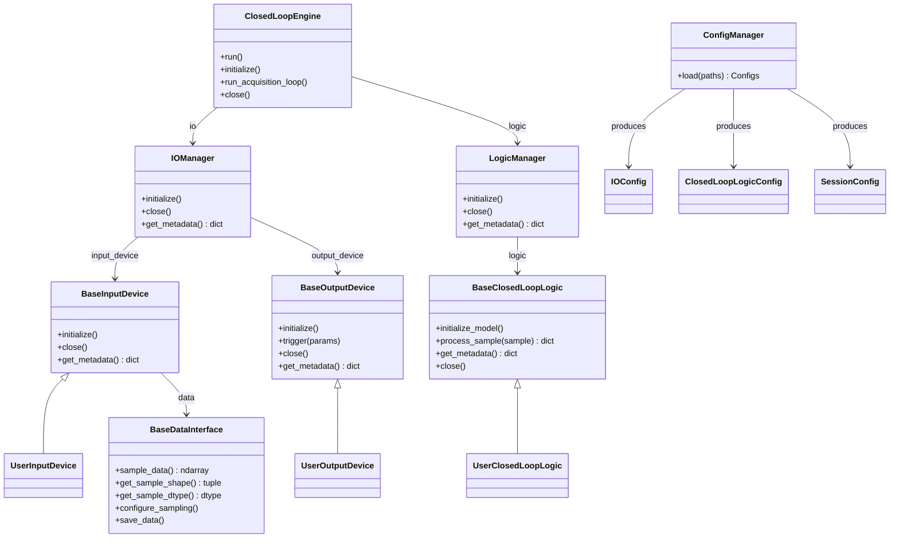

# CLEF Class Hierarchy

# All boxes are **classes**. Arrows show **inheritance** or **composition** (labeled with the held reference). No data flow is shown here — see `system_overview.md`.

**Legend**

| Symbol | Meaning |
|---|---|
| All boxes | Classes |
| `BaseXxx` | Abstract base class (defined in `core/`) |
| `UserXxx` | User-supplied subclass (lives in `apps/`) |
| `XxxConfig` | Pydantic model for config validation |
| `──▷` (open arrow) | Inheritance: subclass extends base |
| `-->` labeled | Composition: left class holds a reference to right |
