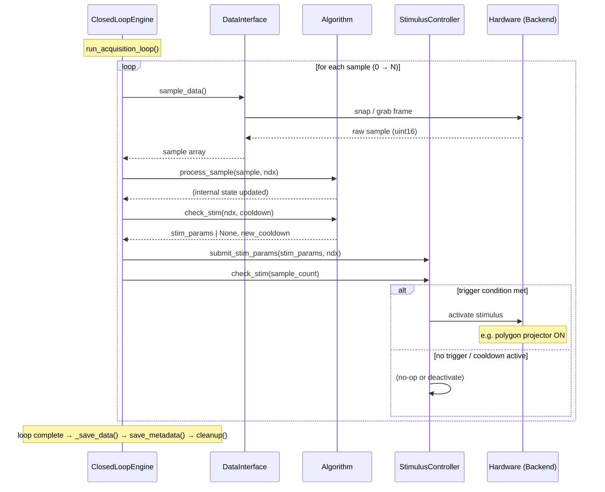

# CLEF Acquisition Loop — One Cycle

```mermaid
sequenceDiagram
    participant E as ClosedLoopEngine
    participant DI as DataInterface
    participant A as Algorithm
    participant SC as StimulusController
    participant HW as Hardware (Backend)

    Note over E: run_acquisition_loop()

    loop for each sample (0 → N)
        E->>DI: sample_data()
        DI->>HW: snap / grab frame
        HW-->>DI: raw sample (uint16)
        DI-->>E: sample array

        E->>A: process_sample(sample, ndx)
        A-->>E: (internal state updated)

        E->>A: check_stim(ndx, cooldown)
        A-->>E: stim_params | None, new_cooldown

        E->>SC: submit_stim_params(stim_params, ndx)
        E->>SC: check_stim(sample_count)

        alt trigger condition met
            SC->>HW: activate stimulus
            Note over HW: e.g. polygon projector ON
        else no trigger / cooldown active
            SC->>SC: (no-op or deactivate)
        end
    end

    Note over E: loop complete → _save_data() → save_metadata() → cleanup()
```
