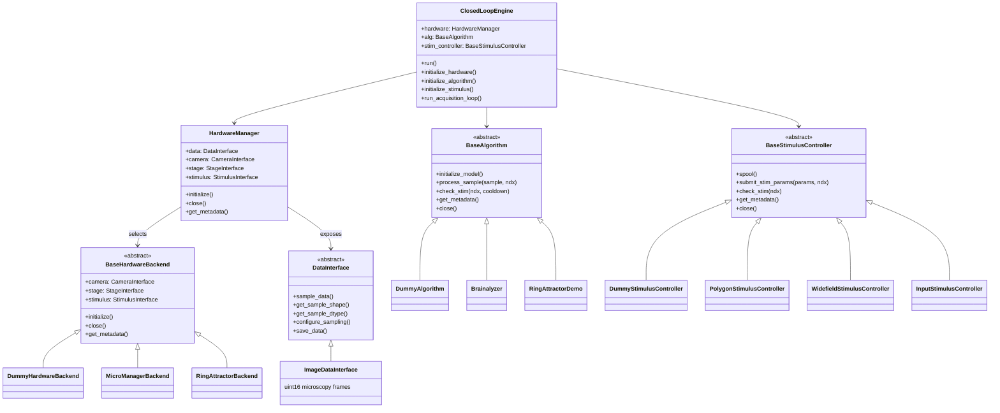

# CLEF Class Hierarchy

```mermaid
classDiagram
    class BaseHardwareBackend {
        <<abstract>>
        +initialize()
        +close()
        +get_metadata()
        +camera: CameraInterface
        +stage: StageInterface
        +stimulus: StimulusInterface
    }

    class DummyHardwareBackend
    class MicroManagerBackend
    class RingAttractorBackend

    BaseHardwareBackend <|-- DummyHardwareBackend
    BaseHardwareBackend <|-- MicroManagerBackend
    BaseHardwareBackend <|-- RingAttractorBackend

    class DataInterface {
        <<abstract>>
        +sample_data()
        +get_sample_shape()
        +get_sample_dtype()
        +configure_sampling()
        +save_data()
    }

    class ImageDataInterface {
        uint16 microscopy frames
    }

    DataInterface <|-- ImageDataInterface

    class BaseAlgorithm {
        <<abstract>>
        +initialize_model()
        +process_sample(sample, ndx)
        +check_stim(ndx, cooldown)
        +get_metadata()
        +close()
    }

    class DummyAlgorithm
    class Brainalyzer
    class RingAttractorDemo

    BaseAlgorithm <|-- DummyAlgorithm
    BaseAlgorithm <|-- Brainalyzer
    BaseAlgorithm <|-- RingAttractorDemo

    class BaseStimulusController {
        <<abstract>>
        +spool()
        +submit_stim_params(params, ndx)
        +check_stim(ndx)
        +get_metadata()
        +close()
    }

    class DummyStimulusController
    class PolygonStimulusController
    class WidefieldStimulusController
    class InputStimulusController

    BaseStimulusController <|-- DummyStimulusController
    BaseStimulusController <|-- PolygonStimulusController
    BaseStimulusController <|-- WidefieldStimulusController
    BaseStimulusController <|-- InputStimulusController

    class HardwareManager {
        +initialize()
        +close()
        +data: DataInterface
        +camera: CameraInterface
        +stage: StageInterface
        +stimulus: StimulusInterface
        +get_metadata()
    }

    HardwareManager --> BaseHardwareBackend : selects
    HardwareManager --> DataInterface : exposes

    class ClosedLoopEngine {
        +hardware: HardwareManager
        +alg: BaseAlgorithm
        +stim_controller: BaseStimulusController
        +run()
        +initialize_hardware()
        +initialize_algorithm()
        +initialize_stimulus()
        +run_acquisition_loop()
    }

    ClosedLoopEngine --> HardwareManager
    ClosedLoopEngine --> BaseAlgorithm
    ClosedLoopEngine --> BaseStimulusController
```
