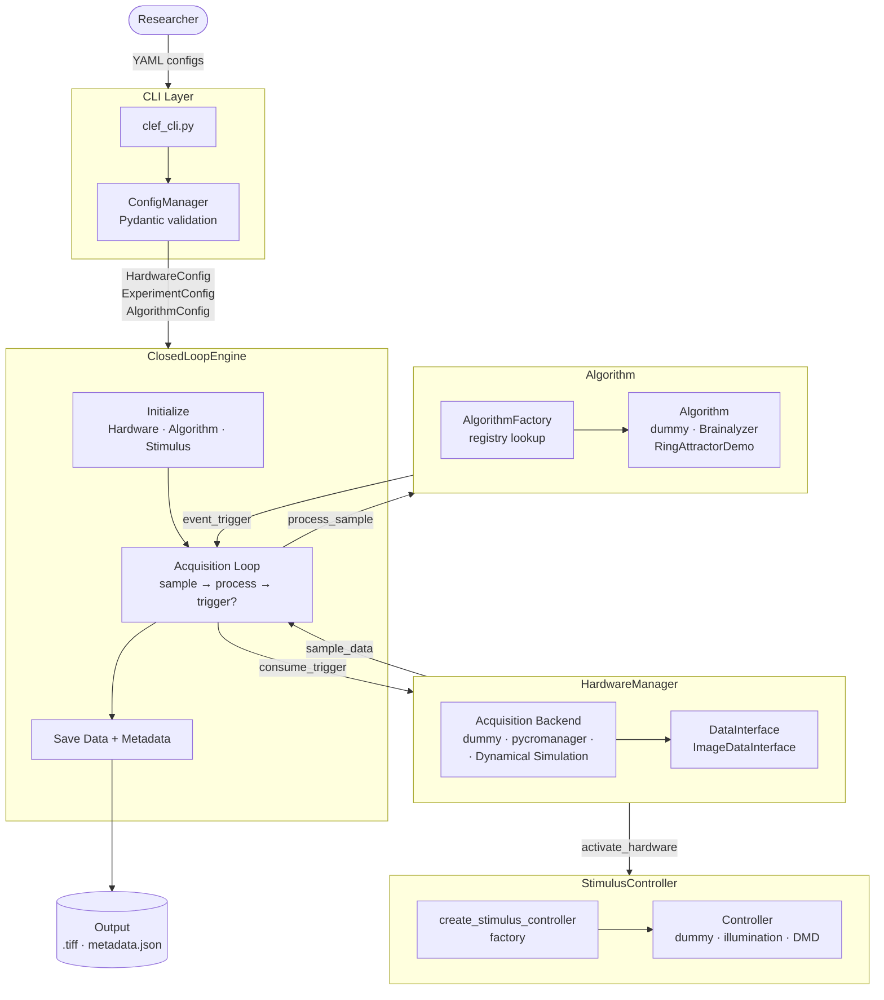

# CLEF System Overview

```mermaid
flowchart TD
    User([Researcher]) -->|YAML configs| CLILayer

    subgraph CLILayer ["CLI Layer"]
        CLIEntry[clef_cli.py]
        CM[ConfigManager<br>Pydantic validation]
        CLIEntry --> CM
    end

    CM -->|HardwareConfig<br>ExperimentConfig<br>AlgorithmConfig| EngineBlock

    subgraph EngineBlock ["ClosedLoopEngine"]
        direction TB
        Init[Initialize<br>Hardware · Algorithm · Stimulus]
        Loop[Acquisition Loop<br>sample → process → trigger?]
        Save[Save Data + Metadata]
        Init --> Loop --> Save 
    end

    subgraph HM ["HardwareManager"]
        Backend[Acquisition Backend<br>dummy · pycromanager · <br>· Dynamical Simulation]
        DI[DataInterface<br>ImageDataInterface]
        Backend --> DI
    end


    subgraph ALG ["Algorithm"]
        AF[AlgorithmFactory<br>registry lookup]
        AR[Algorithm<br>dummy · Brainalyzer<br>RingAttractorDemo]
        AF --> AR
    end

    subgraph SC ["StimulusController"]
        SCF[create_stimulus_controller<br>factory]
        SCI[Controller<br>dummy · illumination · DMD ]
        SCF --> SCI
    end

    HM -->|sample_data| Loop
    ALG -->|event_trigger| Loop
    HM -->|activate_hardware| SC
    Loop -->|consume_trigger| HM
    Loop -->|process_sample| ALG

    Output[(Output<br>.tiff · metadata.json)]
    Save --> Output
```
