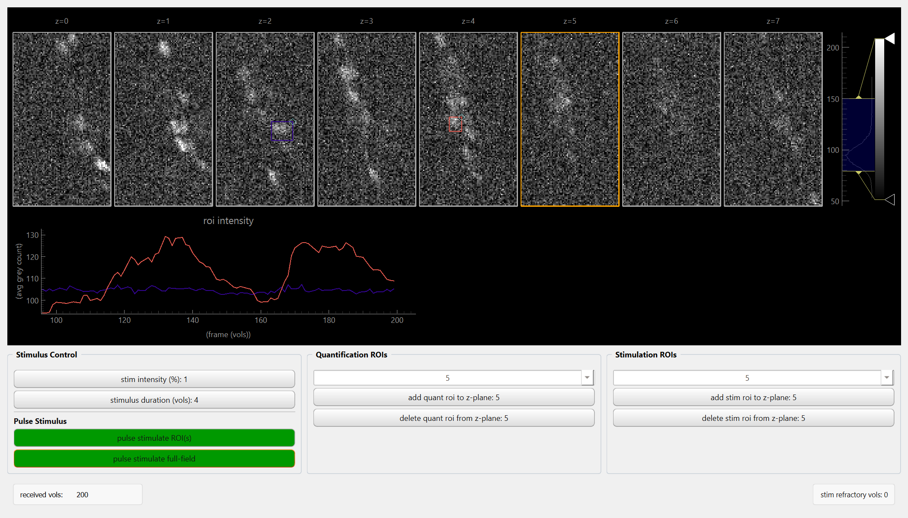

# Summary

CLEF (Closed-Loop Experimental Framework) is an open-source Python platform for real-time closed-loop experiments with automated stimulus control. This first CLEF release targets microscopic imaging modalities for neuroscience researchers. CLEF enables researchers to observe neural activity or organism behavior, process real-time data according to pre-defined user-specified algorithms, and deliver stimuli in a single feedback loop governed entirely by declarative configuration files. CLEF also provides a GUI interface for live monitoring and controlling experiments.

The core philosophy behind CLEF is that a flexible framework will allow rapid design of custom experiments that naturally scale. CLEF replaces ad-hoc lab scripts and GUI-only workflows with a modular, config-driven architecture where hardware backends, real-time analysis algorithms, and stimulus controllers are interchangeable components selected at runtime via YAML.

# Statement of Need

Traditional neuroscience experiments typically follow a fixed, open-loop protocol: researchers design the experiment, set parameters, collect data subject to a fixed stimulus protocol, and analyze results afterward. This approach has yielded insight for many questions, but it is fundamentally mismatched to how dynamical biological systems operate: brains are highly recurrent networks in which activity patterns shape future states. To understand causal relationships in these systems, we need experiments that perturbatively and adaptively probe a system in response to its evolving state.

Closed-loop experimental design allows real-time adaptation of stimulus protocols based on ongoing measurements. The value of this approach has been recognized across multiple areas of study and model systems [@grosenick2015]. As measurement technologies scale to capture hundreds or thousands of neurons simultaneously, closed-loop methods become increasingly important for understanding network-level mechanisms of brain function.

## State of the Field

Closed-loop experiments require coordinated control of multiple hardware components (cameras, stages, stimulation devices) while performing low-latency, real-time computation on streaming data. The computational pipeline must extract features from raw measurements, decide what to do based on the current state of the interrogated system, and execute stimulus protocols with precise timing. Building this coordination layer from scratch for every new experiment is a barrier to wider adoption of closed-loop methods.

Existing tools cover individual parts of the problem. While Python is the predominant programming language in the biosciences, many established frameworks are written in non-Python languages: Bonsai in C# [@lopes2015], the Open Ephys GUI in C++ [@siegle2017], and ScanImage in MATLAB [@pologruto2003]. Several otherwise-Python tools target a different domain or stage of the workflow: Open Ephys focuses on electrophysiology rather than imaging [@siegle2017], while CaImAn [@giovannucci2019] and Suite2p [@pachitariu2017] provide offline calcium-imaging analysis without experiment orchestration. Tools such as Stytra [@stih2019], ACQ4 [@campagnola2014], and Autopilot [@saunders2019] provide closed-loop control but are specialized to particular rigs or behavioral paradigms. Commercial microscopy software exposes limited scripting that works for simple automated protocols but lacks the sophistication needed for responsive, state-dependent experiments. Pycro-Manager [@pinkard2021] brought Python-based control to Micro-Manager [@edelstein2014] and enabled complex acquisition sequences, but does not itself supply the architecture for closed-loop experimentation with multiple hardware components and real-time decision-making outside the Micro-Manager ecosystem. CLEF is written entirely in Python, so researchers can use NumPy [@harris2020], SciPy [@virtanen2020], scikit-learn [@pedregosa2011], PyTorch [@paszke2019], and any other library directly inside their experimental logic.

# Software Design

CLEF uses a layered architecture in which independent components communicate through simple interfaces. Researchers can extend parts of the system (adding new hardware, implementing new logic algorithms) for their individual application without needing to modify the rest of the codebase.

## Key Concepts

CLEF is organized around four concepts used throughout the rest of this manuscript:

+-------------+--------------------------------------------------------------------+
| Concept | Purpose |
+=============+====================================================================+
| `device` | An `input_device` provides a data stream (e.g. camera images); |
| | an `output_device` is something the experimenter controls (e.g. a |
| | stage or a laser). |
+-------------+--------------------------------------------------------------------+
| `logic` | A control algorithm: it processes samples from the input devices |
| | and emits updates for the output devices. |
+-------------+--------------------------------------------------------------------+
| `session` | Application-specific metadata for a run (e.g. data subject, cell |
| | line, treatment condition). |
+-------------+--------------------------------------------------------------------+
| `engine` | A discrete event loop orchestrating data sampling, processing, |
| | and actuation. |
+-------------+--------------------------------------------------------------------+

At runtime, the engine reads from every registered input device, passes the samples to the logic algorithm, and dispatches output commands to any subset of the registered output devices (\autoref{fig:overview}).


## Code Architecture

The repository is split into two top-level trees. `core/` contains the framework internals: base classes, managers, the engine, configuration logic, and the CLI. `apps/` contains concrete implementations that register against the core base classes via plugin discovery, plus per-application YAML configs.

- **CLI entry point** (`core/utils/clef_cli.py`) accepts either a preset name (`clef <app_name>`) that resolves to a directory under `apps/config/`, or explicit `--session`, `--io`, and `--logic` paths.
- **ClosedLoopEngine** (`core/engine/closed_loop_engine.py`) owns an `IOManager` and a `LogicManager` and runs the sample loop: acquire from input devices, pass to logic, dispatch any returned commands to output devices.
- **ConfigManager** (`core/config/config_manager.py`) loads, validates, and merges the three configuration files against Pydantic models, catching invalid parameters before any hardware is initialized.
- **IOManager** (`core/io/`) instantiates the `BaseInputDevice` and `BaseOutputDevice` subclasses listed in `io.yaml`. Each input device is paired with a `BaseDataInterface` that controls how its stream is buffered, structured, and persisted at end of session.
- **LogicManager** (`core/logic/`) instantiates the `BaseClosedLoopLogic` subclass selected by `logic.yaml` and connects it to the devices held by the IOManager.

At runtime, the data flow is symmetric and minimal:

```
input_devices → engine → closed-loop logic → engine → output_devices
```

# Customizing CLEF for your New Experiment

A new experiment is built by writing (or reusing) input devices, output devices, logic algorithms, and three configuration files. The four base abstractions (`BaseInputDevice`, `BaseOutputDevice`, `BaseDataInterface`, `BaseClosedLoopLogic`) each define a small interface researchers fill in:

1. **Create an input device.** Subclass `BaseInputDevice` to wrap any source of streaming data (a camera, an electrode amplifier, a stage readout, a TIFF stack).
2. **Create an output device.** Subclass `BaseOutputDevice` to wrap any actuator (an LED, a DMD, a motorized stage).
3. **Create a closed-loop logic algorithm.** Subclass `BaseClosedLoopLogic` to implement the experiment's online analysis and decision rules.
4. **Pair input devices with a data interface (optional).** Subclass `BaseDataInterface` to separate _how a sample looks_ from _how it is stored_ (shape, dtype, end-of-session serialization); new modalities need no engine changes, and the per-session output bundle maps cleanly onto storage systems such as minimo [@borchardt2021].
5. **Write the three configuration files.** `io.yaml` lists devices and parameters, `logic.yaml` selects the algorithm and its parameters, and `session.yaml` describes the run (operator, subject, conditions, output, duration); all are Pydantic-validated at startup.
6. **Run the experiment.** `clef <app_name>` loads the files from `apps/config/<app_name>/`. Each session writes per-device data files plus one JSON metadata file capturing the merged configuration, every timestamped output event, and per-device sample timestamps.

Full descriptions of each base class's interface, the registry mechanism, configuration schemas, and the CLI are provided in the online documentation.

# Demos

CLEF ships with several demo configurations covering a range of use cases, including synthetic dynamical systems, recorded data playback, and real microscope hardware. Each demo lives in its own directory under `apps/config/`.

## Limit Cycle Demo (`apps/config/limit_cycle/`)

The limit cycle demo captures CLEF's core motivation: interrogating a dynamical process whose rules are hidden. A virtual bistable system with two concentric limit cycles produces time-varying activity, and the experimenter must observe, hypothesize, and intervene in real time to discern how its dynamics are structured.

The `limit_cycle_input` device generates 2-D frames of a punctum orbiting one of two rings (\autoref{fig:limitcycle}); the state is an angular position plus a radial mode (inner or outer ring). The `limit_cycle_output` device delivers stimuli that perturb the angular position or toggle between rings, optionally auto-triggered when the system enters a specified angular region. The demo shows how CLEF separates data generation, online analysis, and stimulus control into independently configurable components.


## Recording Playback Demo (`apps/config/recording_playback/`)

The recording playback demo offers the same GUI and analysis interface as the physical-hardware configuration but reads from an existing volumetric calcium imaging dataset (a TIFF stack) via `recording_playback_input` instead of a live microscope, letting users develop and refine analysis pipelines against real neural data without hardware. The `brainalyzer_logic` algorithm quantifies neural activity across z-planes in real time (offloaded to `brainalyzer_worker.py` over shared memory) and supports stimulus parameter exploration through the GUI (\autoref{fig:brainalyzer}).



## Speech BCI Demo (`apps/config/speech_bci/`)

The speech BCI demo illustrates the network-service logic pattern and CLEF's use with 1-D timeseries data (electrophysiology of spiking neurons). `speech_bci_input` provides neural spiking data, the logic streams it over WebSocket to a FastAPI decoder server (`apps/subprocess/speech_bci_server.py`) running a GRU + n-gram language model in Docker, and decoded text is rendered through `speech_bci_output`. Zero-copy shared-memory transfer is also available to minimize latency when the model runs on the same host. The demo shows how CLEF supports deployed, standalone, networked models.

# Research Impact Statement

The physical hardware demo (`apps/config/physical_hardware/`) is CLEF's primary production use case: a full volumetric calcium imaging experiment that acquires data, quantifies it online via the brainalyzer logic, and delivers spatially patterned optogenetic stimuli through the Mightex Polygon1000 digital micromirror device in a closed loop. It requires the corresponding microscope hardware (camera, stage, Micro-Manager device adapters, Polygon1000, and 89North LDI LS). CLEF is applied daily in our own lab [@dunn2025] and by collaborators, presently deployed on at least 5 microscopy systems and used by 15 researchers across two university campuses.

# Availability and Documentation

CLEF is open-source software released under the MIT license. The code is available on GitHub at <https://github.com/focolab/clef>. Documentation includes installation instructions, configuration guides, a vibe-coding quickstart for AI-assisted app development, and the demo configurations described above.

We welcome contributions: the modular architecture supports adding new hardware devices or logic types without modifying framework code, and issues and pull requests can be opened on the GitHub repository.

# AI Usage Disclosure

AI coding assistants were used during development to facilitate refactoring of parts of the codebase, improve test coverage, and to facilitate manuscript citation formatting. All scientific content, architectural decisions, and final code were authored and reviewed by the listed authors.

# Acknowledgements

We thank members of the Kato lab for valuable discussion.

Data for this study were acquired at the UCSF Innovation Core at the Weill Institute for Neurosciences on a custom imaging system controlled by the open-source software packages Micro-Manager and Pycro-Manager.

This work was supported by NIH grants NS115572 (R.L.D.), R35GM124735 (S.K.), and the Weill Institute for Neurosciences (S.K.).

# References
